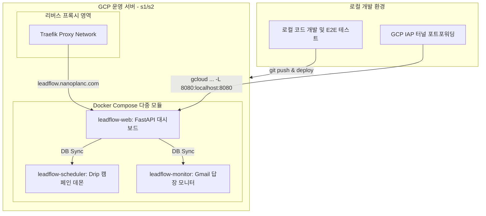

# 🚀 LeadFlow B2B 영업 자동화 플랫폼 배포 매뉴얼

본 문서는 격리 분리된 **LeadFlow** 프로젝트를 **GCP IAP(Identity-Aware Proxy) 터널 보안망**과 **Docker Compose**를 기반으로 운영 서버(s1 / s2 / s3)에 무중단 배포 및 가동하기 위한 인프라 매뉴얼입니다.

---

## 🎨 핵심 인프라 구조 및 구성도



---

## 🛡️ GCP IAP 터널링을 이용한 서버 접속 가이드

GCP 보안 정책 상 서버의 직접 SSH(22번 포트) 접속은 차단되어 있습니다. 반드시 아래의 **IAP 터널 기반 gcloud 명령어**를 사용하여 접속 및 보안 터널을 구성해야 합니다.

### 1. 운영 서버(s1) SSH 원격 접속
```bash
# gmc-master-server 접속 (s1)
gcloud compute ssh gmc-master-server \
  --zone=us-west1-b \
  --project=gmc-master-infra \
  --tunnel-through-iap
```

### 2. 로컬 브라우저 접근을 위한 IAP 포트포워딩
서버의 외부 포트를 열지 않고, 로컬호스트(`localhost:8080`)를 통해 보안 터널로 서버의 어드민 대시보드에 접근할 수 있습니다.
```bash
# 로컬 8080 포트를 서버 8080 포트로 바인딩 포워딩
gcloud compute ssh gmc-master-server \
  --zone=us-west1-b \
  --project=gmc-master-infra \
  --tunnel-through-iap \
  -- -L 8080:localhost:8080 -N
```
> 💡 **접속 확인**: 위 명령어를 켠 채로 로컬 브라우저에서 [http://localhost:8080](http://localhost:8080)에 접속하면 서버에서 가동 중인 LeadFlow 대시보드에 즉시 안전하게 도달합니다.

---

## ⚙️ 필수 환경변수 설정 (`.env`)

배포를 실행하기 전에 최상위 경로에 `.env` 파일을 생성하고 운영 환경에 맞는 환경변수와 API 키를 정확히 기재합니다.

```env
# 네이버 OpenAPI 설정 (지역 검색 수집용)
NAVER_CLIENT_ID=your-naver-client-id
NAVER_CLIENT_SECRET=your-naver-client-secret

# OpenAI API 설정 (GPT-4o-mini 초개인화 도입부 생성용)
OPENAI_API_KEY=your-openai-api-key

# Gmail API OAuth 설정 (운영서버 config 디렉토리에 파일 업로드 필요)
GMAIL_CREDENTIALS_PATH=config/gmail_credentials.json
GMAIL_TOKEN_PATH=config/gmail_token.json
SENDER_EMAIL=your-workspace-email@yourdomain.com
SENDER_NAME=영업본부_김대리

# Google Sheets CRM 설정 ( sheets_service_account.json 업로드 필요 )
GOOGLE_SHEETS_CREDENTIALS_PATH=config/sheets_service_account.json
GOOGLE_SHEETS_NAME=영업_현황판

# 데이터베이스 및 수신거부 보안 설정
DATABASE_URL=sqlite:///./data/leadflow.db
APP_ENV=production
LOG_LEVEL=INFO
OPT_OUT_BASE_URL=http://localhost:8080
OPT_OUT_SECRET_KEY=generate-random-secure-string-key
```

> ⚠️ **중요 (OAuth Credentials)**: `gmail_credentials.json` 및 `sheets_service_account.json` 자격증명 파일은 소스 깃 저장소에 올리면 안 되므로, 서버의 `./leadflow/config/` 디렉토리에 직접 생성/업로드한 후 컨테이너에 마운트하여 기동해야 합니다.

---

## 🚀 Docker Compose 무중단 배포 절차 (`deploy.sh`)

최상위에 동봉된 `deploy.sh` 쉘 스크립트를 사용해 무중단 빌드 및 건강 상태 체크(Health Check), 에러 시 자동 롤백 기능을 전격 지원합니다.

```bash
# 1. 실행 권한 부여 (로컬 또는 서버 최초 배포 시)
chmod +x deploy.sh

# 2. 통합 무모킹 테스트 → 이미지 빌드 → 서비스 가동 파이프라인 가동 (권장)
./deploy.sh

# 3. 만약 테스트 절차를 스킵하고 즉각 배포하고 싶을 때
./deploy.sh --skip-tests

# 4. 배포 실패 또는 서비스 이상 시 이전 정상 동작 버전으로 즉각 롤백 복원
./deploy.sh --rollback
```

### 🔍 deploy.sh 파이프라인 작동 메커니즘
1. **Pre-flight**: Git 변경 사항 및 로컬 Docker 데몬 구동 점검.
2. **Test Running**: `pytest` 로직을 자동 수행하여 안전성 E2E 100% 자가 검증.
3. **Image Backup**: 기존 구동 중인 정상 이미지를 `:rollback` 태그로 자동 백업.
4. **Multistage Build**: `docker compose build --no-cache` 로 클린 빌드.
5. **Auto Deployment**: 신규 3대 컨테이너 백그라운드 기동.
6. **HTTP Health Check**: 로그인 API 엔드포인트 응답(HTTP 200)을 30초간 폴링 조회. 
   - **실패 시**: 에러 로그 수집 후 `:rollback` 태그 이미지를 다시 `latest`로 강제 매핑하여 **무중단 자동 롤백 복원 작동**.

---

## 📦 데이터 볼륨 보존 및 백업

모든 중요한 영업 리드 정보와 캠페인 스케줄 데이터베이스는 컨테이너 내부가 아닌 호스트 경로에 안전하게 마운트 보존됩니다.
* SQLite DB 보관 경로: `./data/leadflow/` 및 `./data/sales_pipeline/`
* 설정 및 자격 증명 보관 경로: `./leadflow/config/` 및 `./sales_pipeline/config/`
